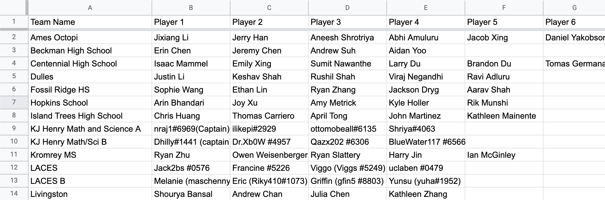

A program to calculate science bowl stats based on science bowl scoresheets.

# Usage
1. Put the scoresheets into a folder called `Scoresheets` and place it in the same folder that this repository is in.
- Note: the scoresheets **must** be excel files.

2. If you're using a roster to generate team stats, paste the roster into `rosters.txt` as a series of names and teams separated by commas. An example is shown in `rosters.txt`.
  - If you have roster data displayed like in the below image, then you can select all of the data (not including the header) and paste into `roster.txt`.
  - Then, run `format_roster.py`. This program will automatically populate `roster.txt` with correctly formatted data.



3. Check the `key.json` file to make select all of the options you want (see [JSON options](#json-options)).
4. Run `stats.py` to generate the stats 

Any python version ≥ 3.5 should work (to import the typing module). You may need to use `python3` instead of `python` in the terminal. 

You will need to install python dependencies before running the program. Run the following in your terminal:

```pip3 install -r requirements.txt```

# Stats Key
- GP: games played (note: this always assumes 23 tossup games)
- 4I: number of questions interrupted correctly. Note: this column will not exist if the scoresheets that you use do not support this
- 4s: number of questions correct that were not interrupts. Note: if "4I" is not supported, then this stat tracks the total number of questions correct, regardless of interrupt
- 0s: number of incorrect buzzes *after* the question was completely read.
- -4s: number of questions interrupted incorrectly
- TUH: tossups heard
- %I: the percentage of a player's buzzes that were interrupts
- 4I/-4: the number of interrupt correct buzzes divided by the number of interrupt incorrect buzzes. Note: this statistic will not appear if "4I" is not supported
- 4s/-4: number of correct buzzes divided by the number of interrupt incorrect buzzes
- P/TUH: average number of points a player scores per tossup they hear
- Points: total number of points scored, where interrupt incorrect buzzes count for -4 points for that player (as opposed to DOE rules, which give 4 points to the other team)
- PPG: the average number of points a player scores per game

# JSON Options
The following options can be changed in `key.json`. The default setting for each boolean parameter is `false`.
- directory: stores the filepath to the folder with the scoresheets
- rosters (default: `""`): stores the filepath to the plaintext file with the rosters, which is a comma-seperated file with the name of the player, followed by the name of their team
- force players onto rosters: 
    - If set to `true`, then if a roster is provided and a player name is not on it, then the program will attempt to find the name with the smallest Levenshtein distance in the roster and use that name.
- category directory: (default: `""`)
    - If every packet has the same category order (e.g. question #1 is always physics, question #2 is always biology), then it may be helpful to include a text file that lists the order of the categories, with each new line denoting a new question category. In that case, this variable would indicate the path to that file.
    - If no such file exists, then set this variable to `""` (an empty string).
- force questions to have categories:
    - If set to `true`, then the program will attempt to detect a category for each question, either by having the category in the column adjacent to the question number column or by having a "subject order" file. __Any question that does NOT have a category will be ignored and not included in the final stat report.__
    - If set to `false`, then which category a question is in will still be tracked, but there is no requirement for questions to have a subject, and questions without a category will still be tracked.
- has interrupt corrects:
    - If set to `true`, then the program will try to track the number of times a player interrupted correctly by looking for an "interrupt correct" symbol in the json file.
    - If set to `false`, then the program does not track this statistic
- track TUH:
    - If set to `true`, then the program will attempt to detect a row on the spreadsheet that has the number of tossups each player heard. __It is highly recommended to set "force questions to have categories" to true as well if this is set to true; otherwise, TUH data may get mistaken for buzz data.__
    - If set to `false`, then the program will assume that each player plays a full game in each spreadsheet that they appear in.
- player names to ignore: 
    - Often times, other strings (like "Bonus" or "Question") are interpreted as player names. Any player names that contain one or more of the strings in this array as substrings will be ignored and assumed to not be a player. 
- cat per packet: stores the number of times each category appears in each packet
- codes: the different cell values that indicate each type of buzz
- categories: the six DOE categories (biology, chemistry, etc.) as well as the different symbols that indicate those categories

# Code
Feel free to make a pull request or open an issue.
